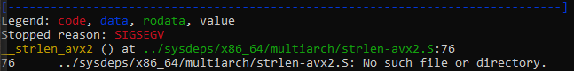

# Buffer overflow

## Requirements
J'ai setup une machine linux avec le strict minimum à savoir:
1. Sur le windows playstore https://apps.microsoft.com/detail/9pkr34tncv07
2. Run `apt-get update`
3. J'ai téléchargé `python2` à travers de `pyenv` https://www.kali.org/docs/general-use/using-eol-python-versions/.
4. Install gdb using 'apt-get install gdp'
5. Install gdb-peda, depuis https://github.com/longld/

## Coding
[crow](https://www.youtube.com/watch?v=6sUd3AA7Q50).

## Truc intéressants

### Quelques commandes
- Sur le shell:
    - `python -c 'print("A" * 200)' | ./vulnerable` pour envoyer 200 fois le caractère A à l'exécutable.
    - `file vulnerable` pour voir des infromations sur l'executable (faut qu'il soit en **not-stripped**).
    - `gdb -q ./vulnerable` pour faire du debug avec GDB sur l'executable.
- Avec GDB du coup:
    - `info functions` pour afficher les informations de fonctions.
    - `disas <function>`, pour afficher le code assembleur d'une fonction
    - `pattern create <nb> <file>`, ça c'est spécifique a GDB-peda.
    - `r < <file>` pour envoyer le contenu d'un fichier en tant qu'input, et run. 

### Setup de l'envirronnement
Dans sa vidéo, *crow* utilise une architecture différence de la notre (32 bits askip, nous c'est du x64), du coup de base lorsqu'on ouvre GDP les registres sont pas les mêmes. Nous c'est R-, pour 64 bits, et lui c'est E- pour 32 bits.

Les résulats obtenus dans la vidéeo sont d'ailleurs bien différents de ceux que nous obtenons. Mais bon, c'est même mieux pour apprendre!
- au niveau du code, voici l'instruction assembleur sur laquelle le programme a butté.

Ok...
> 0x7ffff7f31dd9 <__strlen_avx2+25>:   vpcmpeqb ymm1,ymm0,YMMWORD PTR [rdi]

C'est quoi ça? xD 

Après si on laisse continuer, j'obtiens ça:

Du coup, *crow* avait facilement trouvé son histoire de pattern, et moi tout content je pensais avoir compris, mais non ! En plus je me retrouve avec cette merde là:
> __strlen_avx2 () at ../sysdeps/x86_64/multiarch/strlen-avx2.S:76

Je suis allé cherché pour ce fichier, à cette ligne précise, et déjà un truc un peu plus buvable:
> addq	$VEC_SIZE, %rdi

Par contre ça ne me donne pas non plus beaucoup d'information que le précédent. Mais je note bien la présence du registre %rdi à chaque fois. Un bref coup d'oeil aux registres:

Je retrouve bien l'instruction, toujours `vpcmpeqb` avec son registre RDI. J'ai tapé:
- `pattern offset 0x412d25414325416e`, valeur du registre RDI...
- et ça m'a donné le même `4696450948646912366 found at offset: 216`, comme __crow__ dans sa vidéo...

Par contre je ne suis pas du tout ce genre de gars qui prend ce qu'on lui donne sans regarder avant de croquer. Dans notre cas, il nous manque beaucoup trop de notions en assembleur pour avoir un réel aperçu de ce qu'il se passe ici.

### Analyzing assembly

The fuck with `vpcmpeqb` instruction?

C'est une instruction SIMD, pour __Single Instruction Multiple Data__, et ça ce reconnait facilement par le `v` au début (pour *vectored*) and pour le `YMM`, registre de 256 bits.

Je me demande, qu'est-ce que ça vient foutre là sérieux? Surtout que le programme contient un `read` et un `printf`, et un appel au __Standart Input/Output__.

En utilisant la commande `disas` avec `gdb-peda$`, on peut lire le code assembleur pour toutes les fonctions du code. Faut bien retenir:
1. une function c'est une suite d'instructions assembleur stockées en mémoire.
2. un symbol fait parti d'une map, est est la clef pour accéder à l'entrée de la fonction en mémoire.

Si on compile le programme juste en utilisant:
> gcc -o <EXE> <.c>

On obtiendra un « (No debugging symbols found in ./vulnerable) ». C’est un autre point important, la portée. Les symboles d'un programme sont facilement localisables en raison de la compilation. Mais pour toutes les fonctions qui ne résident pas dans le programme, elles ne font pas partie de sa portée (dans notre cas à la fois _read_ et _printf_);

Cela signifie que ces fonctions doivent être __resolved__ pour que le CPU sache où il se branche (généralement l’instruction “ CALL”). Ces fonctions sont facilement identifiables dans GDB grâce au @plt; qui signifie que ces symboles ont été chargés à partir de la table __Procedure Linkage Table__, ce qui permet à ces instructions de résoudre implicitement l’emplacement mémoire correspondant. Nous reviendrons sur ce concept plus tard.

Pour déboguer ces fonctions (c.-à-d. regarder le code d’assemblage de la fonction), GCC fournit le flag `-g` afin d'indiquer au compilateur d’inclure des métadonnées dans l’exécutable, qui permettront de resoudre ces fonctions. GDB différencierait alors 2 fonctions avec des symboles connexes, les fonctions définies à partir du fichier compilé (dans mon cas, `main` et `vulnerable`), et les symboles __Non-debugging symbols__ où se trouvent les `printf@plt` et `read@plt`. 

En revant au code, et en mettant un break point à main:
> b main

Step | %rip             | %rsp              | *(%rsp) as Top of Stack   | Comment
---- | ---------------- | ----------------- | ------------------------- | -----------------------------------------
0    | 0x555555555209   | 0x7fffffffdb50    | -                         | Main entry point.
1    | 0x55555555520e   | 0x7fffffffdb50    | -                         | Reaching call instruction.
2    | -                | -                 | -                         | Computing the return address as (%rip+1).

### Session de debug

Maintenant que je peux faire une session de debug de manière optimisée, nous allons juste arrêter de regarder crow, parce que ses explications sont pas franchement folles.

Le prochain document (1_notes) sera consacré à un commentaire succint des étapes suivantes de la vidéo de *crow*.
