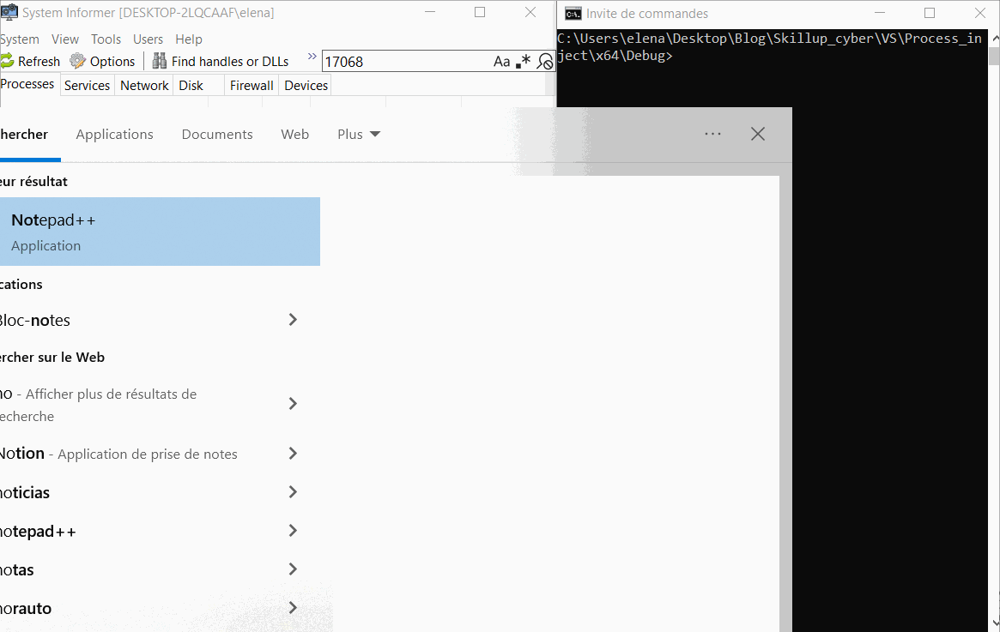

# Malware Development: Process Injection

Sur windows: https://www.youtube.com/watch?v=A6EKDAKBXPs

## Résumé

Le nom **process injection** est déjà suffisament explicite, et consiste en un ensemble de techniques visans à exécuter du code arbitraire en utilisant un programme ouvert sur le système d'exploitation.

Dans la video, il est bien spécifié que *Windows Defender* doit être désactivé; d'ailleurs il existe aussi d'autres méchanismes, par exemple le NX bit, qui signale au CPU qu'aucune instruction ne peut être éxecutée depuis la stack du programme.

Un autre point important est l'architecture sur laquelle va être exécuté le programme; elle doit correspondre à celle utilisée pour compiler le programme d'injection (dans mon cas c'est un *AMD Ryzen 7*, donc une architecture **x86-64**).

## Code

Dans la mesure où le système d'exploitation cible est windows, nous utiliserons la MSDN documentation pour utiliser la WIN32 API, entre autre pour la création et la gestion de threads et de process, pour l'allocation de mémoire virtuelle etc..

Dans la vidéo, *crow* utilise un programme en langage C, qui consiste en un simple main avec un unique argument pour l'identifiant du process sur lequel il faudra injecter du code malicieux.

A ce titre, la fonction [OpenProcess](https://learn.microsoft.com/en-us/windows/win32/api/processthreadsapi/nf-processthreadsapi-openprocess) permet d'ouvrir un process existant, avec un accès spécifique (PROCESS_VM_WRITE, we could use PROCESS_ALL_ACCESS). Il semble évident que l'utilisation d'un accès *élevé* sucitera tout l'intérêt du Windows Defender qui ne tardera pas à identifier le code comme étant malicieux, et donc le mettre en quarantaine pour ensuite l'éliminer.
	
### Result

Comme présenté dans la vidéo ci-dessus, poru trouver l'identifiant d'un process *cible*:
> tasklist | findstr <process_name>

Ensuite pour monitoriser l'état de ce même process, chercher l'ID dans [System Informer](https://systeminformer.sourceforge.io/).

Finalement, afin d'injecter le programme malicieux:
> Process_inject.exe <process_id>

## Shellcode generation

### References
- Dans la vidéo de *crow* à partir de `40:00`.
- [Metasploit Basics, Part 9: Using msfvenom to Create Custom Payloads](https://www.hackers-arise.com/post/2017/07/31/metasploit-basics-part-9-using-msfvenom-to-create-custom-payloads)
- [ZeroTotal: Msfvenom Calc](https://steve-s.gitbook.io/0xtriboulet/zerototal/zerototal-msfvenom-calc)

Comme lui, nous utiliserons le **metsploit/msfvenom** pour générer un array de bytes contenant le *shell code*. Néanmoins, nous n'utiliserons pas le *reverse_tcpip*, puisque selon moi, il ne fait que miroiter un potentiel qui, à bien des égards, n'est pas du tout cohérent avec la réalité.

> En effet, faire un *reverser_tcp* en local, c'est bien joli, mais la réalité est que si le PC de l'attaquant n'est pas sur le même réseau, il va devoir passer par le router avant de pouvoir accéder au dispositif infecté. Si aucun port n'est ouvert, rien ne passera.

Nous préférerons donc un exemple bien plus modeste, mais pas moins explicite, la création d'un payload pour ouvrir l'application calculette de windows !

### Commandes utiles

Déjà, j'ai remarqué que les commandes à **mfsvenom** prenait toujours un peu de temps avant de s'éxecuter. Ensuite, au niveau des paramètres:
- **-e** pour l'encoder, utilisé pour éviter la détection du shell code, et assurer son éxecution sur la cible.
	- *x86/shikata_ga_nai* (en japonais "On ne peut rien y changer").
- **--platform** pour spécifier le système d'exploitation de la cible.
	- *windows*
- **-f** pour le format de sortie du payload (il y en a deux types, executable et *transform formats*).
	- *exe*
- **-p** pour les options du payload, qui peuvent être retrouvées indivuellement:
> msfvenom -p <payload_name> --list-options
	
### Pas à pas

- Excluire le dossier de la solution dans widows defender. Sinon ce sera détecté comme trojan et éliminé directement après que le code ait été compilé.

- Pour générer un shell code basique sur une architecture **x64**:
> msfvenom --platform windows --arch x64 -p windows/x64/exec CMD="calc.exe" -f c

- Pour rediriger la sortie de la commande jusqu'à un fichier texte:
> [CMD] > shellcode.txt

- Copier coller le contenu du fichier texte directement dans le programme.
	
## DLL injection
Dans la vidéo de *crow*, il y a un passage particulièrement intéressant sur la création d'une DLL (Dynamic Loaded Library), et l'injection de process dans cette même DLL :p

### References
- https://learn.microsoft.com/en-us/windows/win32/dlls/dllmain
- https://www.geoffchappell.com/studies/windows/win32/kernel32/api/index.htm
- Vidéo de *crow* à partir de `45:00`

### Code
_BOOL WINAPI DllMain_ c'est le `main` des DLL, et nous l'utiliserons dans le cas présent afin de créer une fenêtre de popup.

Pour la tester ensuite:
> rundll32 DLL_injection.dll,DllMain

## Injection
### Code
Tout est dans le code de la solution **DLL_injection**.
