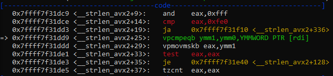
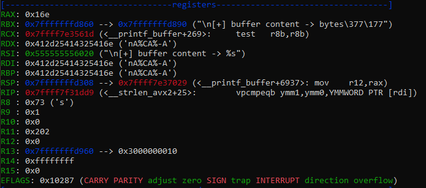

# Buffer overflow

## Requirements
I setted up a really minimal Kali linux machine on WSL.
1. On windows playstore https://apps.microsoft.com/detail/9pkr34tncv07
2. Then just 'apt-get update'
3. Downloaded python2 through pyenv from https://www.kali.org/docs/general-use/using-eol-python-versions/
4. Install gdb using 'apt-get install gdp'
5. Install gdb-peda, from https://github.com/longld/

## Coding
Following video from [crow](https://www.youtube.com/watch?v=6sUd3AA7Q50).

## Notable shits

### Some commands
- on shell:
    - `python -c 'print("A" * 200)' | ./vulnerable` to send 200 times the A value at executing the vulnerable script.
    - `file vulnerable` to look at the executable file information (not-stripped).
    - `gdb -q ./vulnerable` to execute GDB on vulnerable sccript.
- on GDB, with __not stripped__ flag from `file` command:
    - `info functions` to have all functions (symbols)
    - `disas <function>` to have assembly code for a <function>
    - `pattern create <nb> <file>` to create a pattern of <nb> bytes within <file> (optionnal).
    - `r < <file>` to pass content of pattern to the executable. 

### Setup the workspace
It appears that _crow_ architecture was different from wich I am working with (crow seams to be 32-bits and mine is AMD-64, as x64). At running the command 'r < pattern.txt' for the first time, I noticed the RSP/RIP (for 64 bits architecture) instead of the 32 bits ESP/EIP registers.

Also, the results was really different from _crow_ one, better to learn that way in fact:
- code section is much more relevant, with assembly code for the portion that leads to the segmentation fault.

I am really not used to read instructions from x86 processor, but anyway, there is a fancy __=>__.
> 0x7ffff7f31dd9 <__strlen_avx2+25>:   vpcmpeqb ymm1,ymm0,YMMWORD PTR [rdi]

What the fuck with that?

Anyway, going onto the stack section, it's different, but _crow_ just skip taht part then..

At the end of this command, I did encounter the exact same structure as:

Where _crow_ easily encountered its __EIP__ pattern value, I did not :3

Instead, I have this ugly:
> __strlen_avx2 () at ../sysdeps/x86_64/multiarch/strlen-avx2.S:76

I search for this file within GNU source code:
> addq	$VEC_SIZE, %rdi

Not much more relevant than the previous one. But I noticed the redundancy of the RDI register, from this resume and from the code one.

A brief look at the registers can make the work. In fact, it shall have been the unic one to look at on !

I retrieved the vpcmpeqb instruction, with its [rdi], and the RDI register. I could be the one that just say:
- `pattern offset 0x412d25414325416e` from RDI register value, by intuition, 
- it give me the same `4696450948646912366 found at offset: 216` as __crow__ in its video...
- I am an easy dude, i just continue with that.

But I am not that easy guy. What is the means? I dediced to dig into the x64 assemby code, cause I really want to understand it, and i have to make another part because that one start to be really lo...

### Analyzing assembly
I strongly recommend the lecture of [my paper](./x86-64_first_raw.md) to continue on this topic:

The fuck with that vpcmpeqb instruction. It appears to be a SIMD instruction, standing for __Single Instruction Multiple Data__, because of the `v` at the beginning (for vectored) and for the YMM register (for 256 bits data).

You'll probably answer me? How do you know? And that is not the point. Why? Why there a fucking SIMD instruction in my C program that just make a `read` and a `printf` calls to __Standart Input/Output__ native library?

Using the `disas` command within `gdb-peda$`, I can have the assembly instructions for all the functions from my code. Some important notions to keep in mind now, and furthermore each time that assembly code is getting involved:
1. a function is a bunch of assembly instructions in memory.
2. a symbol is a map element, wich the key is the code function, and the data is the related memory location.

If you just compile your program basically using:
> gcc -o <EXE> <.c>

But you'll probably getting a `(No debugging symbols found in ./vulnerable)`. That is an other important point, the scope. The symbols from your program are easily locatable because of the compilation shits. But for the functions from outside the scope of your program (in my case both _read_ and _printf_), it means that they have to be __resolved__ in order for the CPU to know where it shall branch (commonly the `CALL` instruction). Also, I can easily identify thoses functions wich symbol is out of the scope, because the have the `@plt` syntax; it means that thoses symbols was loaded from the __Procedure Linkage Table__, allowing thoses instructions to implicitly resolve the related memory location.

To debug thoses functions (i.e. look at the function assembly code), GCC provide the `-g` flag to allow GCC to include metadata within the executable. GDB would then differentiate 2 functions with related symbols (memory address), the defined ones from the compiled file (in my case `main` and `vulnerable`), and thoses __Non-debugging symbols__ where I can retrieved thoses `printf@plt` and `read@plt` symbols. 
 
Coming back to my code, with a breakpoint at the `main` entry point:

Step | %rip             | %rsp              | *(%rsp) as Top of Stack   | Comment
---- | ---------------- | ----------------- | ------------------------- | -----------------------------------------
0    | 0x555555555209   | 0x7fffffffdb50    | -                         | Main entry point.
1    | 0x55555555520e   | 0x7fffffffdb50    | -                         | Reaching call instruction.
2    | -                | -                 | -                         | Computing the return address as (%rip+1).

### Debugging session

Now I can perform a GDB session easily. I will use the pattern.txt to have an entry that will cause a SEGMENTATION FAULT, but I am going to look at it step by step. First, putting a breakpoint in the main function:
> break main

Then by using `stepi` GDB command, I could step on the next instruction. Let's move on by monitorizing both Stack and Instruction Pointers, beginning at the main entry point.